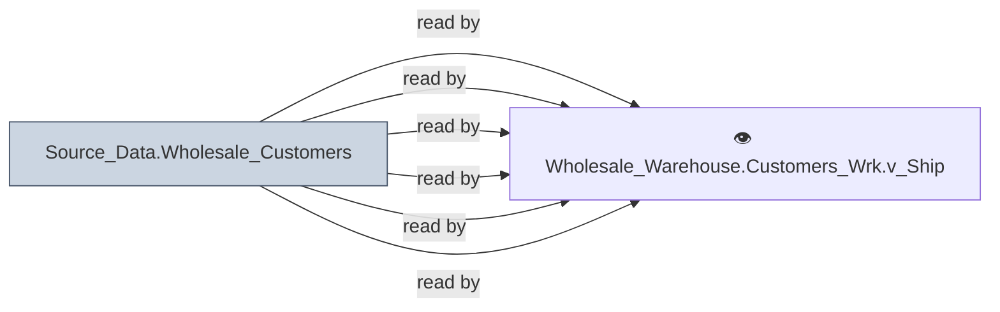

# 🔍 `Source_Data.Wholesale_Customers`

[← Tables](README.md) · [← Data Flow](../README.md) · [← Root](../../../README.md)

## Lineage

## Writers (0)

_(no writers detected — possibly read-only or written by external process)_

## Readers (6)

- 👁️ `Wholesale_Warehouse.Customers_Wrk.v_AccountMaster`
- 👁️ `Wholesale_Warehouse.Customers_Wrk.v_DeliveryWindow`
- 👁️ `Wholesale_Warehouse.Customers_Wrk.v_ExtendedCustomerProfile`
- 👁️ `Wholesale_Warehouse.Customers_Wrk.v_ServiceRepGroup`
- 👁️ `Wholesale_Warehouse.Customers_Wrk.v_ServiceRepID`
- 👁️ `Wholesale_Warehouse.Customers_Wrk.v_ShippingLocations`

---
