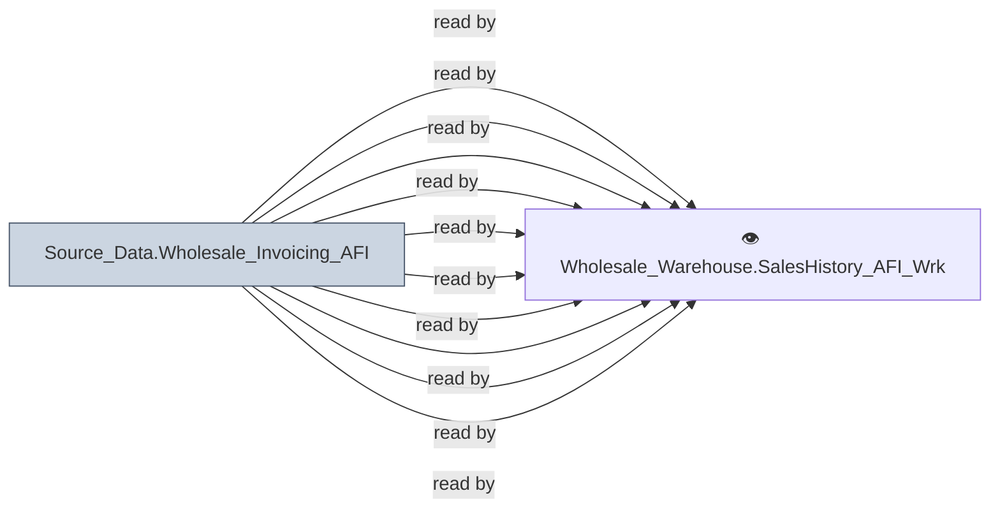

# 🔍 `Source_Data.Wholesale_Invoicing_AFI`

[← Tables](README.md) · [← Data Flow](../README.md) · [← Root](../../../README.md)

## Lineage

## Writers (0)

_(no writers detected — possibly read-only or written by external process)_

## Readers (12)

- 👁️ `Wholesale_Warehouse.SalesHistory_AFI_Wrk.v_InvoiceConsumerInformation`
- 👁️ `Wholesale_Warehouse.SalesHistory_AFI_Wrk.v_InvoiceDetail`
- 👁️ `Wholesale_Warehouse.SalesHistory_AFI_Wrk.v_InvoiceDetailProperties`
- 👁️ `Wholesale_Warehouse.SalesHistory_AFI_Wrk.v_InvoiceHeader`
- 👁️ `Wholesale_Warehouse.SalesHistory_AFI_Wrk.v_InvoiceValueAddedTax`
- 👁️ `Wholesale_Warehouse.SalesHistory_AFI_Wrk.v_ItemComments`
- 👁️ `Wholesale_Warehouse.SalesHistory_AFI_Wrk.v_OpenInvoices`
- 👁️ `Wholesale_Warehouse.SalesHistory_AFI_Wrk.v_OrderComments`
- 👁️ `Wholesale_Warehouse.SalesHistory_AFI_Wrk.v_ShippedHistoryCommAdjustment`
- 👁️ `Wholesale_Warehouse.SalesHistory_AFI_Wrk.v_ShippedHistoryDiscounts`
- 👁️ `Wholesale_Warehouse.SalesHistory_AFI_Wrk.v_ShippedHistoryExpressServiceTracking`
- 👁️ `Wholesale_Warehouse.SalesHistory_AFI_Wrk.v_SpecialCharges`

---
