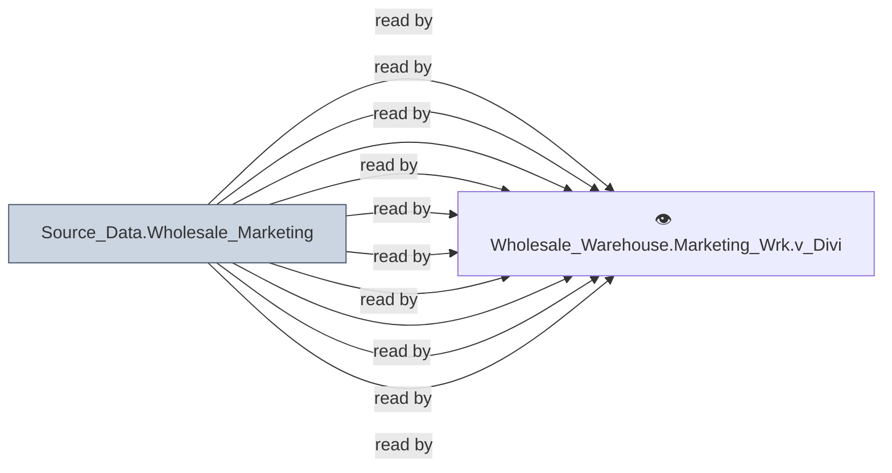

# 🔍 `Source_Data.Wholesale_Marketing`

[← Tables](README.md) · [← Data Flow](../README.md) · [← Root](../../../README.md)

## Lineage

## Writers (0)

_(no writers detected — possibly read-only or written by external process)_

## Readers (35)

- 👁️ `Wholesale_Warehouse.Marketing_Wrk.v_AFValueList`
- 👁️ `Wholesale_Warehouse.Marketing_Wrk.v_AdFundsRequest`
- 👁️ `Wholesale_Warehouse.Marketing_Wrk.v_AdNotice`
- 👁️ `Wholesale_Warehouse.Marketing_Wrk.v_AdNoticeDetail`
- 👁️ `Wholesale_Warehouse.Marketing_Wrk.v_BusinessType`
- 👁️ `Wholesale_Warehouse.Marketing_Wrk.v_BusinessTypeLifeStyleArea`
- 👁️ `Wholesale_Warehouse.Marketing_Wrk.v_CRMAdvertisingFunds`
- 👁️ `Wholesale_Warehouse.Marketing_Wrk.v_CRMVelocityDriver`
- 👁️ `Wholesale_Warehouse.Marketing_Wrk.v_CustomerOwnershipExceptions`
- 👁️ `Wholesale_Warehouse.Marketing_Wrk.v_Divisions`
- 👁️ `Wholesale_Warehouse.Marketing_Wrk.v_FinancialDivision`
- 👁️ `Wholesale_Warehouse.Marketing_Wrk.v_Goals`
- 👁️ `Wholesale_Warehouse.Marketing_Wrk.v_ItemMaster`
- 👁️ `Wholesale_Warehouse.Marketing_Wrk.v_LocationDeliveryMode`
- 👁️ `Wholesale_Warehouse.Marketing_Wrk.v_MarketCommitments`
- 👁️ `Wholesale_Warehouse.Marketing_Wrk.v_MarketCommitmentsSum`
- 👁️ `Wholesale_Warehouse.Marketing_Wrk.v_MarketLookup`
- 👁️ `Wholesale_Warehouse.Marketing_Wrk.v_MarketPotential`
- 👁️ `Wholesale_Warehouse.Marketing_Wrk.v_MoSeriesMargins`
- 👁️ `Wholesale_Warehouse.Marketing_Wrk.v_MrktSpclstInfo`
- 👁️ `Wholesale_Warehouse.Marketing_Wrk.v_MrktSpclstMaster`
- 👁️ `Wholesale_Warehouse.Marketing_Wrk.v_MrktSpclstRegion`
- 👁️ `Wholesale_Warehouse.Marketing_Wrk.v_PresBillToExceptions`
- 👁️ `Wholesale_Warehouse.Marketing_Wrk.v_ProductLineMaster`
- 👁️ `Wholesale_Warehouse.Marketing_Wrk.v_Regions`
- 👁️ `Wholesale_Warehouse.Marketing_Wrk.v_RepCustomerFilter`
- 👁️ `Wholesale_Warehouse.Marketing_Wrk.v_SalesCategory`
- 👁️ `Wholesale_Warehouse.Marketing_Wrk.v_SalesTeamMaster`
- 👁️ `Wholesale_Warehouse.Marketing_Wrk.v_SalesTeamMembers`
- 👁️ `Wholesale_Warehouse.Marketing_Wrk.v_SetDetailCustom`
- _… +5 more_

---
