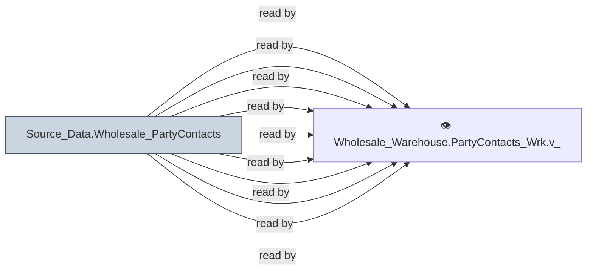

# 🔍 `Source_Data.Wholesale_PartyContacts`

[← Tables](README.md) · [← Data Flow](../README.md) · [← Root](../../../README.md)

## Lineage

## Writers (0)

_(no writers detected — possibly read-only or written by external process)_

## Readers (9)

- 👁️ `Wholesale_Warehouse.PartyContacts_Wrk.v_AddressMaster`
- 👁️ `Wholesale_Warehouse.PartyContacts_Wrk.v_CommunicationInfo`
- 👁️ `Wholesale_Warehouse.PartyContacts_Wrk.v_ContactBase`
- 👁️ `Wholesale_Warehouse.PartyContacts_Wrk.v_ContactDefaults`
- 👁️ `Wholesale_Warehouse.PartyContacts_Wrk.v_ContactMaster`
- 👁️ `Wholesale_Warehouse.PartyContacts_Wrk.v_ContactValueList`
- 👁️ `Wholesale_Warehouse.PartyContacts_Wrk.v_Locations`
- 👁️ `Wholesale_Warehouse.PartyContacts_Wrk.v_PartyMaster`
- 👁️ `Wholesale_Warehouse.PartyContacts_Wrk.v_ProfileDetail`

---
