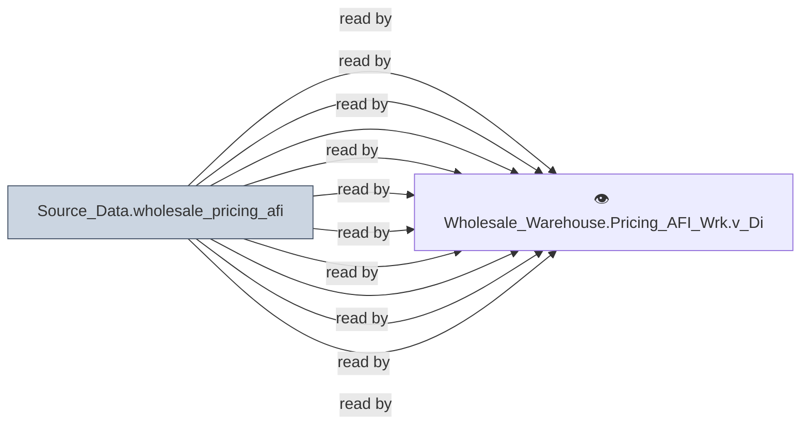

# 🔍 `Source_Data.wholesale_pricing_afi`

[← Tables](README.md) · [← Data Flow](../README.md) · [← Root](../../../README.md)

## Lineage

## Writers (0)

_(no writers detected — possibly read-only or written by external process)_

## Readers (20)

- 👁️ `Wholesale_Warehouse.Pricing_AFI_Wrk.v_BuyGroupDefault`
- 👁️ `Wholesale_Warehouse.Pricing_AFI_Wrk.v_BuyGroupMaster`
- 👁️ `Wholesale_Warehouse.Pricing_AFI_Wrk.v_BuyGroupMember`
- 👁️ `Wholesale_Warehouse.Pricing_AFI_Wrk.v_BuyGroupPrice`
- 👁️ `Wholesale_Warehouse.Pricing_AFI_Wrk.v_CommissionClass`
- 👁️ `Wholesale_Warehouse.Pricing_AFI_Wrk.v_CommissionCodes`
- 👁️ `Wholesale_Warehouse.Pricing_AFI_Wrk.v_CustomerPricingSetup`
- 👁️ `Wholesale_Warehouse.Pricing_AFI_Wrk.v_DiscountClass`
- 👁️ `Wholesale_Warehouse.Pricing_AFI_Wrk.v_DiscountCodes`
- 👁️ `Wholesale_Warehouse.Pricing_AFI_Wrk.v_DiscountRates`
- 👁️ `Wholesale_Warehouse.Pricing_AFI_Wrk.v_ExpressFreightInfo`
- 👁️ `Wholesale_Warehouse.Pricing_AFI_Wrk.v_FreightClass`
- 👁️ `Wholesale_Warehouse.Pricing_AFI_Wrk.v_FreightCodes`
- 👁️ `Wholesale_Warehouse.Pricing_AFI_Wrk.v_FreightRates`
- 👁️ `Wholesale_Warehouse.Pricing_AFI_Wrk.v_FreightZones`
- 👁️ `Wholesale_Warehouse.Pricing_AFI_Wrk.v_PriceCode`
- 👁️ `Wholesale_Warehouse.Pricing_AFI_Wrk.v_PriceExceptions`
- 👁️ `Wholesale_Warehouse.Pricing_AFI_Wrk.v_PriceList`
- 👁️ `Wholesale_Warehouse.Pricing_AFI_Wrk.v_SalesClass`
- 👁️ `Wholesale_Warehouse.Pricing_AFI_Wrk.v__PriceCodeArchive`

---
