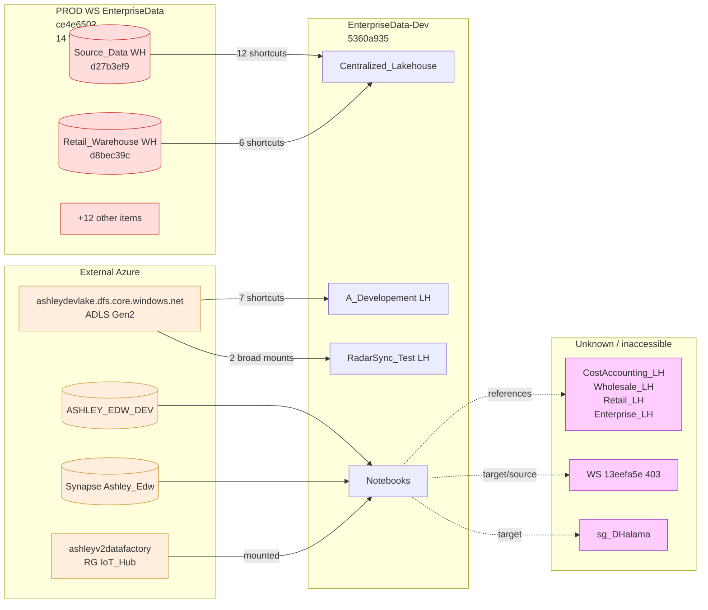

# 🔗 06 — Cross-Workspace Dependencies

[← Root](../../README.md)

## Map

## Sub-pages

- [PROD dependencies](prod-dependencies.md) — 18 OneLake shortcuts + PROD inventory
- [ADLS storage](adls-storage.md) — 9 ADLS Gen2 shortcuts to `ashleydevlake`
- [Inaccessible references]
- [🔌 Connections (12)](connections.md) — data sources (SharePoint, SQL, Lakehouse)
(inaccessible-refs.md) — workspaces and items I couldn't read

## Summary

| Category | Count | Detail |
|---|---|---|
| OneLake shortcuts within DEV (Fabric-internal) | 385 | Internal table-to-files mapping |
| OneLake shortcuts to PROD WS | **18** | All to `ce4e6503-...` Source_Data + Retail_Warehouse |
| ADLS Gen2 shortcuts | **9** | All to `ashleydevlake.dfs.core.windows.net` |
| Inaccessible workspaces | 2 | WS `13eefa5e-...` (403), WS `sg_DHalama` (by name) |
| Unresolvable lakehouses | 4 + 1 stale | CostAccounting_LH, Wholesale_LH, Retail_LH, Enterprise_LH, stale 75f83a27 |

---
