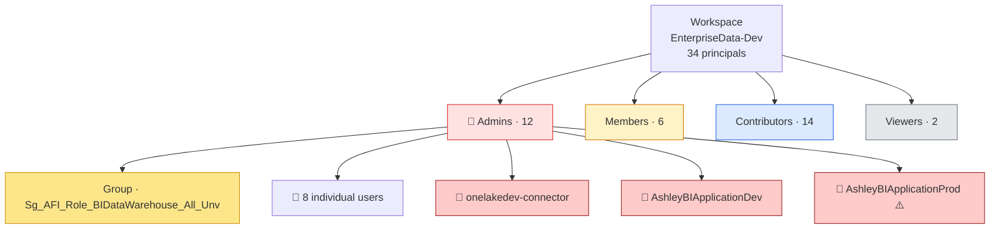

# 🔐 07 — Permissions

[← Root](../../README.md)

## Role distribution (34 principals)

## Composition

| Type | Count |
|---|---|
| Users | 22 |
| Apps (SPN) | 8 |
| Groups | 4 |

**No external (non-`@Ashleyfurniture.com`) users.**

## Admin principals (12)

| Principal | Type | Identifier |
|---|---|---|
| `Sg_AFI_Role_BIDataWarehouse_All_Unv` | Group | `16e2d46b-29e7-4988-8756-096a7d8b9d1a` |
| `Rick Steinke` | User | `RSteinke@Ashleyfurniture.com` |
| `Robert Horton` | User | `BHorton@Ashleyfurniture.com` |
| `Andrew Steinke` | User | `ASteinke@Ashleyfurniture.com` |
| `Rick Steinke` | User | `Admin-RSteinke@ashleyfurniture.com` |
| `Andy Steinke` | User | `Admin-ASteinke@ashleyfurniture.com` |
| `Akshay Mawle` | User | `AMawle@ashleyfurniture.com` |
| `Rajavigneswarran Jayaram` | User | `RJayaram@ashleyfurniture.com` |
| `Padmanabhan Ramadoss` | User | `PRamadoss@ashleyfurniture.com` |
| `onelakedev-connector` | App | `558ce77f-4dd2-4a0b-87e9-ab66688f8a84` |
| `AshleyBIApplicationDev` | App | `dcf4eadd-071a-4760-9023-76a5238ed655` |
| ⚠️ `AshleyBIApplicationProd` | App | `2b8e5809-208b-421c-823f-407be58133ce` |

## ⚠️ Service Principals — concentrated power

| SPN | Object ID | Inferred purpose | Risk |
|---|---|---|---|
| `onelakedev-connector` | `558ce77f-...` | OneLake access bridge for connectors | 🟠 Wide blast radius |
| `AshleyBIApplicationDev` | `dcf4eadd-...` | Dev-tier app (used by dev jobs) | ✅ Acceptable for Dev |
| `AshleyBIApplicationProd` | `2b8e5809-...` | Prod app (used by prod jobs) — **Admin on Dev WS** | 🔴 Cross-env contamination (C2) |

**Action item:** treat `AshleyBIApplicationProd` as security-critical. Rotate, scope-down, or remove.

## Capacity & identity

| Field | Value |
|---|---|
| Capacity ID | `30d06c17-b0f4-4709-9a20-e29c96e8863e` |
| Region | East US |
| Tier | Dedicated, Large dataset format |
| SKU | Not visible from current scope (capacity owned by another subscription) |
| Workspace identity (SPN) | `14bfa211-3cab-40ae-bfd3-23c853ef619f` |

---
