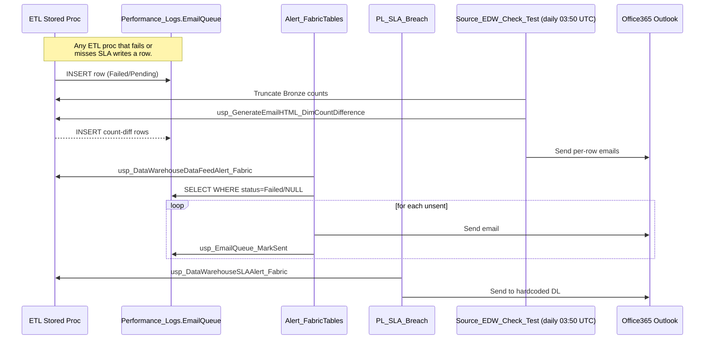

# Monitoring System

[← Operations](README.md) · [← Root](../../README.md)

## How monitoring works

**Key facts:**
- `Source_EDW_Check_Test` is the **only consistently-running** pipeline (daily 03:50 UTC)
- `Alert_FabricTables_EnterpriseData` and `PL_SLA_Breach_EnterpriseData` are **manually triggered** today
- `FabricSLA_Trigger_EnterpriseData` was supposed to wrap them but is empty (risk C6)
- The `f7ca7cad-...` Office365Email connection failed with `DMTS_EntityNotFoundOrUnauthorized` on a manual run — confirm scheduled email actually delivers (C24)

---
