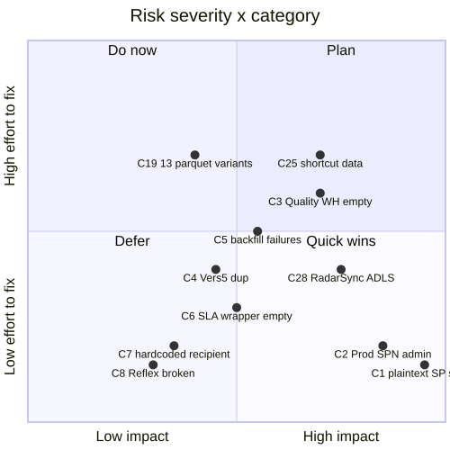

# ⚠️ 09 — Risks (28 total)

[← Root](../../README.md)

## Distribution



```
🔴 Critical:  █ 1     (security)
🔴 High:      ████ 4  (security/architecture)
🟠 Medium:    ████████ 8 (orchestration/maintainability)
🟡 Low:       ███████████████ 15 (cleanup/naming)
```

## Sub-pages

- [Critical & High (5)](critical-and-high.md) — must address
- [Medium (8)](medium.md)
- [Low (15)](low.md)

## Full register

| # | Severity | Category | Issue | Target | Action |
|---|---|---|---|---|---|
| C1 | 🔴 Critical | Security | Plaintext SP secret `<REDACTED-rotate-pending>` in `MetaData-Pull` cell 1 (AshleyBI app, tenant `5a9d9cfd-...`) | `MetaData-Pull notebook` | Rotate immediately. Cells 2/3 use Key Vault correctly; delete cell 1 |
| C2 | 🔴 High | Security | `AshleyBIApplicationProd` SPN holds Admin on Dev workspace | `permissions` | Remove or downgrade to Contributor |
| C3 | 🔴 High | Architecture | `Quality_Warehouse` (PROD tier) is empty (0 tables/procs) | `Quality_Warehouse` | Either build or remove |
| C25 | 🔴 High | Architecture | 5.92B rows in Centralized_Lakehouse are shortcut-backed (not real DEV data) | `Centralized_Lakehouse` | Document, ensure team doesn't write back |
| C28 | 🔴 High | Security | `RadarSync_Test` mounts entire trusted+raw ADLS zones — broad scope | `RadarSync_Test` | Restrict scope or audit access |
| C26 | 🟠 Medium | Operations | 38/41 orchestration items have no recent run history | `run history` | Audit dormants; remove unused |
| C27 | 🟠 Medium | Lineage | 4 unresolvable lakehouses referenced by notebooks | `notebooks` | Document or remove broken refs |
| C4 | 🟠 Medium | Maintainability | 3 near-duplicate `Vers 5` notebooks with subtle differences and stale lakehouse GUIDs | `Vers5 trio` | Collapse to one parameterized notebook |
| C5 | 🟠 Medium | Reliability | `Retail_Prod_To_Dev_DataBackFill` snapshot Inactive; failures stable since 2026-04-29 | `Retail_Prod_To_Dev_DataBackFill` | Audit; fix and re-enable or delete |
| C6 | 🟠 Medium | Orchestration | `FabricSLA_Trigger_EnterpriseData` empty (intended scheduler wrapper) | `FabricSLA_Trigger_EnterpriseData` | Build or delete |
| C7 | 🟠 Medium | Notification | Hardcoded email recipient in `PL_SLA_Breach` | `PL_SLA_Breach` | Move to EnvironmentControl config table |
| C8 | 🟠 Medium | Orchestration | `Reflex 2024-05-29` cannot export — likely abandoned | `Reflex` | Confirm and delete |
| C24 | 🟠 Medium | DQ | Office365Email connection `f7ca7cad-...` failed `DMTS_EntityNotFoundOrUnauthorized` on manual run | `Source_EDW_Check_Test` | Confirm scheduled branch actually delivers |
| C9 | 🟡 Low | Architecture | Stranded business tables in ETL_Framework (Manufacturing_Maximo.Fedex etc.) | `ETL_Framework` | Move to domain WHs |
| C10 | 🟡 Low | Maintainability | 4 clones of TableDictionary (`_clone`, `_edw_1`, `_Test`, `_Security`) | `ETL_Framework` | Consolidate; document authoritative copy |
| C11 | 🟡 Low | Cleanup | Two empty Dataflow staging LH+WH pairs | `DataflowsStaging*` | Delete after confirming Dataflow Test empty |
| C12 | 🟡 Low | Compatibility | Env runtime drift: Env01 on 1.2, Dev on 1.3 | `environments` | Migrate Env01 to 1.3 |
| C13 | 🟡 Low | Cleanup | 5 empty test pipelines | `test pipelines` | Delete |
| C14 | 🟡 Low | Naming | `test` and `pipeline1` are real cross-WS PROD copies | `test+pipeline1` | Rename to descriptive names |
| C15 | 🟡 Low | Notebooks | `Notebook 13` runs `sc.addPyFile('https://raw.githubusercontent.com/microsoft/fabric-samples/.../util.py')` | `Notebook 13` | Pin to commit SHA or vendor in Environment library |
| C16 | 🟡 Low | Notebooks | `Vers 5` references stale lakehouse GUID `75f83a27-...` | `Vers 5` | Update or remove |
| C17 | 🟡 Low | Notebooks | `Sys_Data_pull` cell 1 saveAsTable contract mismatch | `Sys_Data_pull` | Use cell 4's mature impl |
| C18 | 🟡 Low | Notebooks | `delta_table_path2` undefined in `Rename column names` | `Rename column names` | Fix or remove |
| C19 | 🟡 Low | Procs | 13 variants of `Usp_CreateTableFromParquet*` | `ETL_Framework` | Consolidate; deprecate dead variants |
| C20 | 🟡 Low | Centralized_LH | `Retail_Corporate` and `Retail_Corporate_Prod` 1:1 mirror at 5.92B rows | `Centralized_Lakehouse` | Identify canonical; delete duplicate |
| C21 | 🟡 Low | Permissions | 12 individual user Admins on Dev workspace + 1 broad group | `permissions` | Adopt least-privilege |
| C22 | 🟡 Low | Descriptions | 70/71 items have empty descriptions | `all items` | Add description for production items |
| C23 | 🟡 Low | Test sandbox | `Test_Owneraccess` warehouse left over from permissions probe | `Test_Owneraccess` | Delete |

---
